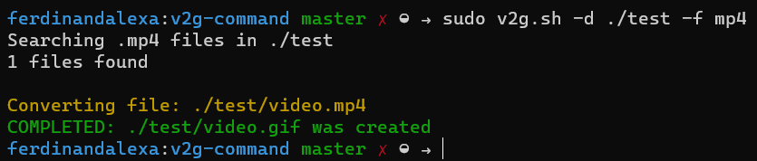

# v2g command

This is a side project to automate part of my workflow and to solve the files video conversion to gif format that I need, because the editing software I use can't to export to gif.

## Requirements
* [FFmpeg](https://ffmpeg.org) installed.
* Bash shell or similar.

## Usage
For the installation you will need to download `v2g.sh` file and copy at `usr/local/bin` folder or create a folder for personal scripts and set the path in your `.bashrc` file (or similar). [Here some references](https://stackoverflow.com/questions/3560326/how-to-make-a-shell-script-global)

To use it you have to launch `v2g.sh` file.

It need two values:

* **`-d`**: directory where to find the video files.
* **`-f`**: video files format to convert to .gif.

All .gif created are saved in the source path of the converted file.

## To-do list
- [ ] Loading spinner during file conversion.
- [ ] Option to define a output folder.
- [ ] -h --help subcommand.
- [ ] Automate install process.

## LICENCE
[MIT - License](LICENSE)